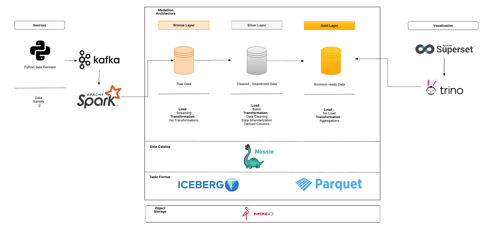

# Real-Time Data Lake Pipeline with Iceberg, Spark, and Kafka

A scalable, near-real-time data pipeline for ingesting, processing, and querying JSON data using Apache Iceberg, Spark Structured Streaming, and Kafka. Designed for ACID-compliant storage, efficient upserts, and seamless cloud deployment.

## 📌 Features

- **Near-Real-Time Ingestion**: API layer with FastAPI for JSON file uploads and Kafka for event streaming.
- **ACID-Compliant Storage**: Apache Iceberg tables managed by Nessie Catalog for versioning and schema enforcement.
- **Distributed Processing**: Spark Structured Streaming with micro-batches (0.1s intervals) for validation, deduplication, and merging.
- **Optimized Querying**: Trino SQL engine for low-latency analytics and time-travel queries.
- **Cloud-Ready**: Dockerized components (MinIO, Kafka, Spark, Nessie, Trino) with AWS deployment guidelines.

## 🏗 Architecture



1. **API Layer**: FastAPI endpoints ingest JSON files into MinIO and publish metadata to Kafka.
2. **Event Streaming**: Kafka decouples ingestion from processing, ensuring fault tolerance.
3. **Spark Processing**: Micro-batch jobs validate, clean, and merge data into Iceberg tables.
4. **Iceberg Storage**: Partitioned, compressed tables with ZSTD and automated compaction.
5. **Trino Analytics**: SQL queries on Iceberg tables with Nessie versioning.

## 🛠 Prerequisites
- Docker & Docker Compose


## 🚀 Getting Started

### 1. Clone the Repository
```bash
git clone https://github.com/Anass-NB/Lakehouse-minio-spark
````

### 2. Start the Docker Containers
```bash
cd Lakehouse-minio-spark
```

```bash
docker-compose up -d
```

## Services
Services Included in the docker-compose file:
- MinIO: S3-compatible object storage for JSON files.
- Kafka: Distributed event streaming platform.
- Spark: Unified analytics engine for big data processing.
- Nessie: Git-like versioning for Iceberg tables.
- Trino: Distributed SQL query engine for Iceberg tables.
- FastAPI: Web API framework for JSON file uploads.
- Data Simulator: Python script for generating sample JSON data upload requests.


## 📂 Directory Structure

```
├── webservice/            # FastAPI upload service
├── simulator/             # Upload JSON data simulator
├── spark-jobs/            # Spark Structured Streaming jobs
├── trino/                 # Trino configuration and queries
├── docker-compose.yml     # Orchestration
├── docs/                  # Architecture diagrams and notes
└── data                   # Sample JSON data and schema
```


## 🖥 Usage
### 1. Upload JSON Files via API
```bash
curl -X POST -F "file=@data/employees/employees_4.json" http://localhost:8000/upload/employees_4

```

### 2. Query Data with Trino
```bash
docker exec -it trino trino
```
Run queries:
```sql
SELECT * FROM iceberg_datalake.default.sessions;
```

## ☁️ AWS Deployment
To deploy on AWS:
1. Replace MinIO with Amazon S3.
2. Use EMR for Spark and MSK for Kafka.
3. Migrate Nessie Catalog to AWS Glue Catalog.
4. Deploy Fast API on EC2 or Fargate behind an ALB.
5. Use Trino on EMR or Athena for querying.

## 📝 License
This project is licensed under the MIT License. See the [LICENSE](LICENSE) file for details.

---

**Built with**:  
[Apache Iceberg](https://iceberg.apache.org/) | [Spark](https://spark.apache.org/) | [Kafka](https://kafka.apache.org/) | [Trino](https://trino.io/) | [Docker](https://www.docker.com/)  
[](https://opensource.org/licenses/Apache-2.0)
[](https://spark.apache.org/)
[](https://www.docker.com/)
[](https://github.com/Elkoumy/real_time_data_lake)